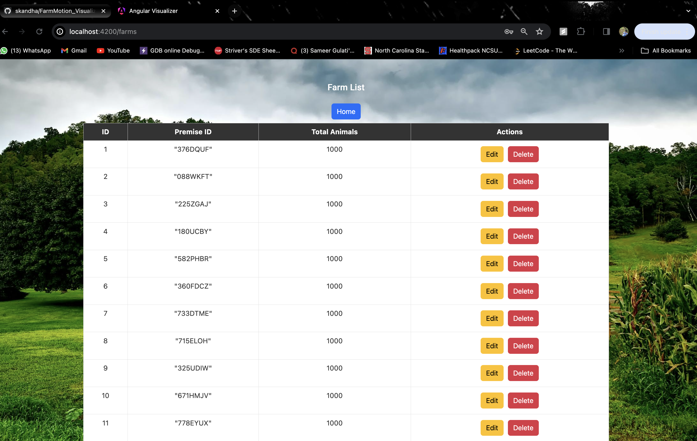

# FarmMotion Visualizer

## Overview

FarmMotion Visualizer is an interactive application designed to visually represent animal movements between farms. The application is built with Angular for the frontend, Spring Boot for the backend, and Postgres as the database.

## Features

- **User Authentication:** Secure login and registration for users.
- **Animal Movement Animation:** Engaging visualization of fictional animal movements.
- **Data Loaders for CSV Files:** Convenient upload components for movement and population data.
- **Data Import:** Well-normalized schema for efficient storage of imported data.
- **UI Controls:** Intuitive user interface to manage all components seamlessly.

## Tech Stack

- **Frontend:** Angular
- **Backend:** Spring Boot
- **Database:** Postgres

## Design

1. **Login and Registration:**
   - Existing users can log in, while new users need to register.
   
2. **Home Page:**
   - Central hub for users after authentication.
   - Option to upload CSV files redirects to separate components for movement and population data.
   
3. **Data Import:**
   - Well-normalized tables showcase the imported data.
   
4. **Animal Movement Animation:**
   - Main feature accessible from the home page.
   - Ensure CSV File is loaded to execute this feature. 
   - Clicking the "Show Animal Movement" button leads to the animation page.
   
5. **Animation Page:**
   - Utilizes OpenCage API for fictional animal movement visualization.
   - Displays movement between origin and destination farms using latitude and longitude coordinates.

### Login Page

*Description: This is the login page where existing users can log in.*

### Register Page

*Description: New users can register on this page to create an account.*

### Home Page

*Description: The main page of the application where users can navigate to different features.*

### CSV Upload

*Description: Page to upload CSV files for movement and population data.*

### Movement Data

*Description: Well-normalized representation of imported movement data.*

### Population Data

*Description: Well-normalized representation of imported population data.*

### Animal Animation

*Description: Animation page showing fictional movement of animals between farms.*

## Getting Started

Follow these steps to set up and run FarmMotion Visualizer, which consists of Angular for the frontend and Spring Boot for the backend.

1. **Clone the Repository:**
   - Clone the FarmMotion Visualizer repository to your local machine.

2. **Navigate to Angular and Spring Boot Directories:**
   - Open two separate terminals.
   - In one terminal, navigate to the `angular-app` directory.
   - In the other terminal, navigate to the `spring-boot-app` directory.

3. **Follow Setup Instructions:**
   - Inside each directory, follow the specific setup instructions for Angular and Spring Boot components.

4. **Run Docker Compose:**
   - In each terminal, run the command `docker-compose up`.
   - This will start the containers for Angular and Spring Boot.

5. **Access the Application:**
   - Once the containers are up and running, open your browser and navigate to the Angular application link.
   - This will direct you to the login page of FarmMotion Visualizer.

Now you're ready to explore the features of FarmMotion Visualizer!

